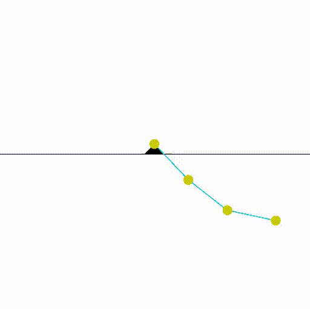

### Generic Planar Robots

In this package, generic robot for simple tests are made available for gym environments.

## Dependencies

This package depends on casadi for dynamics generation and gym.
Dependencies should be installed through pip installation, see below.

## Installation
```bash
pip3 install -e .
```

## Switching

Environments can be created using the normal gym syntax.
For example the below code line creates a planar robot with 3 links and a constant k.
Actions are torques to the individual joints.
```python
env = gym.make('nLink-reacher-tor-v0', n=3, dt=0.01, k=2.1)
```
## Examples

For a constant controlled torque, the simulation is displayed below:

 
 
